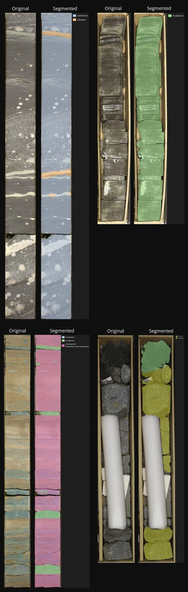

# Rock Types Segmentation API — User Guide

A simple HTTP API for asynchronous **semantic segmentation of rock types in the core images**.

Send an image, get a `job_id`, poll the job until it finishes, then download the segmented image or get a JSON result (includes detected classes and a base64 PNG).

## 🚀 Features
* **Asynchronous queue:** submissions are queued and processed in order; you receive a `job_id` immediately.
* **Two result formats:** 
  * **PNG** (binary image with overlayed predicted mask)  
  * **JSON** (metadata + base64 image with overlayed predicted mask)
* **Configurable mask opacity:** adjust how strongly the predicted mask is blended onto the original image (`0 <= mask_weight <= 1`).
* **Authenticated access:** all user-facing endpoints require an API key header.

## 📸 Demonstration



## ⛏️Supported rock types
* Sandstone
* Siltstone
* Mudstone
* Dolomite
* Limestone
* Anhydrite
* Interlayered sandstones and mudstones
* Interlayered siltstones and mudstones
* Conglomerate
* Crust
* Marl rock

## 🔗 Endpoints

### `POST /predict`
Submit a new image for segmentation.
* **Headers**: `api-key: <YOUR_API_KEY>`
* **Form fields**:
  * `file` — image file (JPEG/PNG)
  * `mask_weight` — optional float in `[0, 1]` (how opaque the overlay is). Defaults to the server default (`0.5`) if omitted.

**Example (curl):**
```bash
curl -X POST "http://<HOST_NAME>/predict" \
  -H "api-key: <YOUR_API_KEY>" \
  -F "file=@example.jpg" \
  -F "mask_weight=0.6"
```

**Response:**
```json
{
  "job_id": "c42b9cbe-81b5-4a53-8a4d-88edb8f6ff82",
  "status": "queued"
}
```

### `GET /job/{job_id}`
Check job status and (when ready) get the result.
* **Headers**: `api-key: <YOUR_API_KEY>`
* **Query**:
  * `form` — `json` (default) or `png`

**Behavior:**
* If job not finished → returns metadata with `"result": null`.
* If job finished → returns either:
  * `form=json`: metadata including `"detected_classes"` (rock names and its RGB mask color) and `"base64"` (base64-encoded PNG)
  * `form=png`: the PNG binary as `image/png` (direct download)

**Example (curl):**

```bash
# ask for metadata + base64 result
curl -H "api-key: <YOUR_API_KEY>" "http://<HOST_NAME>/job/<job_id>?form=json"

# download PNG directly
curl -H "api-key: <YOUR_API_KEY>" -o result.png "http://<HOST_NAME/job/<job_id>?form=png"
```

**Response when finished:**

```json
{
  "job_id": "88fea123-72c8-45e1-8e53-b93570e7c3b8",
  "status": "finished",
  "created_at": 1760657042.6906676,
  "started_at": 1760657042.6912308,
  "finished_at": 1760657047.3353314,
  "error": null,
  "result": {
    "detected_classes": {
      "mudstone": [
        152, 
        223,
        138
      ],
      "limestone": [
        197,
        176,
        213
      ]
    },
    "base64": "iVBORw0KGgoAAAAN..."
  }
}
```

## 🔄 Status lifecycle
A job moves through these statuses:
* `queued` — submitted, waiting in the queue
* `started` — a worker began processing this job
* `finished` — processing completed successfully; result available
* `failed` — processing failed (see error in response)

When polling, check status and stop polling when it is `finished` or `failed`.

## 💻 Quick usage examples
**Python (requests) — submit, poll, download PNG**
```python
import requests
import time
import base64

API_KEY = "<YOUR_API_KEY>"
HOST = "http://<HOST_NAME>"
headers = {"api-key": API_KEY}

# submit
with open("core.jpg","rb") as f:
    res = requests.post(f"{HOST}/predict", headers=headers, files={"file": f}, data={"mask_weight": 0.5})
job_id = res.json()["job_id"]

# poll
while True:
    time.sleep(2)
    res = requests.get(f"{HOST}/job/{job_id}?form=json", headers=headers)
    info = r.json()
    status = info["status"]
    print("status:", status)
    if status == "finished":
        b64 = info["result"]["base64"]
        open("result.png","wb").write(base64.b64decode(b64))
        break
    if status == "failed":
        print("error:", info.get("error"))
        break
```

**curl — submit & get PNG**
```bash
# submit
curl -X POST "http://<HOST_NAME>/predict" \
  -H "api-key: <YOUR_API_KEY>" \
  -F "file=@core.jpg" \
  -F "mask_weight=0.5"

# then download when finished
curl -H "api-key: <YOUR_API_KEY>" -o result.png "http://<HOST_NAME>/job/<job_id>?form=png"
```

## 💡 Best practices
* Upload a photo that contains **only one core** (one individual core per image). The model is optimized for single-core images — multiple cores may reduce segmentation quality.
* Always store or download results after job completion — results are temporary.
* Use reasonable polling frequency (e.g., 1-3 seconds) and avoid flooding the API with requests.

## 🤝 Contact
To obtain the `HOST_NAME` and your `API_KEY`, please contact the service owner:
* **Email**: [vivchar.nikita@yandex.com](mailto:vivchar.nikita@yandex.com?subject=Cores%20API)
* **Telegram**: [@NickV1v](https://t.me/Nickv1v)


